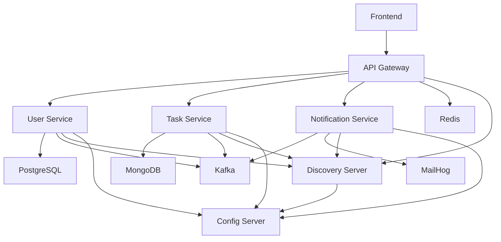

# 🐳 Docker Deployment Guide

Полное руководство по развертыванию Super Pet Platform с использованием Docker Compose.

## 📋 Содержание

- [Требования](#требования)
- [Быстрый старт](#быстрый-старт)
- [Архитектура](#архитектура)
- [Управление сервисами](#управление-сервисами)
- [Конфигурация](#конфигурация)
- [Отладка](#отладка)
- [Troubleshooting](#troubleshooting)

---

## 🔧 Требования

### Минимальные требования:
- **Docker**: 24.0+
- **Docker Compose**: 2.20+
- **RAM**: 8 GB (рекомендуется 16 GB)
- **Disk**: 20 GB свободного места
- **CPU**: 4 cores (рекомендуется)

### Проверка версий:
```bash
docker --version
docker-compose --version
```

---

## 🚀 Быстрый старт

### 1. Сборка и запуск всех сервисов

```bash
# Сборка всех сервисов
./scripts/docker-build.sh

# Запуск
./scripts/docker-start.sh
```

### 2. Проверка статуса

```bash
docker-compose ps
```

### 3. Доступ к сервисам

| Сервис | URL | Описание |
|--------|-----|----------|
| 🌐 Frontend | http://localhost:3000 | React приложение |
| 🔗 API Gateway | http://localhost:8080 | Единая точка входа |
| 👤 User Service | http://localhost:8081 | Управление пользователями |
| ✅ Task Service | http://localhost:8082 | Управление задачами |
| 📧 Notification Service | http://localhost:8084 | Уведомления |
| 🔐 Keycloak | http://localhost:8180 | IAM (admin/admin) |
| 🔍 Eureka | http://localhost:8761 | Service Discovery |
| 📧 MailHog | http://localhost:8025 | Email тестирование |
| 📊 Schema Registry | http://localhost:8081 | Avro схемы |

---

## 🏗️ Архитектура

### Порядок запуска сервисов:

```
1. Инфраструктура (параллельно):
   ├── PostgreSQL
   ├── MongoDB
   ├── Redis
   ├── Zookeeper
   └── Kafka → Schema Registry

2. Config Server
   └── Централизованная конфигурация

3. Discovery Server (Eureka)
   └── Service Registry

4. Business Services (параллельно):
   ├── User Service
   ├── Task Service
   └── Notification Service

5. API Gateway
   └── Маршрутизация запросов

6. Frontend
   └── UI приложение
```

### Зависимости между сервисами:



---

## 🎮 Управление сервисами

### Скрипты управления

#### Сборка
```bash
./scripts/docker-build.sh
```
Компилирует Java/Kotlin сервисы и создает Docker образы.

#### Запуск
```bash
./scripts/docker-start.sh
```
Запускает все сервисы в правильном порядке.

#### Остановка
```bash
./scripts/docker-stop.sh
```
Останавливает все сервисы.

#### Очистка
```bash
./scripts/docker-clean.sh
```
⚠️ Удаляет все контейнеры, образы и данные!

#### Просмотр логов
```bash
# Все сервисы
docker-compose logs -f

# Конкретный сервис
./scripts/docker-logs.sh api-gateway

# Последние 100 строк
docker-compose logs --tail=100 user-service
```

### Docker Compose команды

```bash
# Запуск всех сервисов
docker-compose up -d

# Запуск конкретного сервиса
docker-compose up -d user-service

# Остановка всех сервисов
docker-compose down

# Остановка и удаление volumes
docker-compose down -v

# Пересборка конкретного сервиса
docker-compose build user-service

# Перезапуск сервиса
docker-compose restart api-gateway

# Просмотр статуса
docker-compose ps

# Просмотр потребления ресурсов
docker stats
```

---

## ⚙️ Конфигурация

### Environment Variables

Основные переменные окружения настраиваются в `docker-compose.yml`.

#### Изменение портов:

```yaml
services:
  frontend:
    ports:
      - "3001:80"  # Изменить на свой порт
```

#### Настройка баз данных:

```yaml
postgres:
  environment:
    POSTGRES_PASSWORD: your-secure-password
```

#### Настройка Kafka:

```yaml
kafka:
  environment:
    KAFKA_OFFSETS_TOPIC_REPLICATION_FACTOR: 3  # Для production
```

### Профили окружения

#### Production

```bash
# Создайте .env файл
cat > .env << EOF
SPRING_PROFILES_ACTIVE=production
DATABASE_PASSWORD=secure-password
JWT_SECRET=your-256-bit-secret
KAFKA_SECURITY_PROTOCOL=SASL_SSL
EOF

docker-compose --env-file .env up -d
```

#### Development с hot reload

```bash
docker-compose -f docker-compose.yml -f docker-compose.dev.yml up -d
```

Включает:
- Debug порты для Java сервисов (5005-5010)
- Hot reload для frontend
- Детальное логирование

---

## 🐛 Отладка

### Debug порты (в dev режиме)

| Сервис | Debug Port |
|--------|-----------|
| Config Server | 5005 |
| Discovery Server | 5006 |
| User Service | 5007 |
| Task Service | 5008 |
| Notification Service | 5009 |
| API Gateway | 5010 |

### Подключение IntelliJ IDEA

1. Run → Edit Configurations
2. Add New → Remote JVM Debug
3. Host: localhost
4. Port: 5007 (для User Service)
5. Debug

### Health Checks

```bash
# Проверка здоровья сервисов
curl http://localhost:8080/actuator/health
curl http://localhost:8081/actuator/health
curl http://localhost:8082/actuator/health

# Проверка всех health checks
docker-compose ps
```

### Просмотр логов с фильтрацией

```bash
# Только ошибки
docker-compose logs | grep ERROR

# Логи за последний час
docker-compose logs --since 1h

# Логи до определенного времени
docker-compose logs --until 2024-01-01T12:00:00
```

---

## 🔥 Troubleshooting

### Проблема: Сервисы не запускаются

**Решение:**
```bash
# Проверить логи
docker-compose logs

# Проверить доступные ресурсы
docker system df

# Очистить неиспользуемые ресурсы
docker system prune -a --volumes
```

### Проблема: Ошибка "port is already allocated"

**Решение:**
```bash
# Найти процесс, использующий порт
lsof -i :8080  # Linux/Mac
netstat -ano | findstr :8080  # Windows

# Остановить сервисы и изменить порты в docker-compose.yml
```

### Проблема: Out of Memory

**Решение:**
```bash
# Увеличить память для Docker Desktop
# Settings → Resources → Memory → 8GB+

# Или ограничить память для конкретных сервисов
services:
  user-service:
    mem_limit: 512m
    mem_reservation: 256m
```

### Проблема: Config Server не может найти конфигурацию

**Решение:**
```bash
# Проверить volume mapping
docker-compose exec config-server ls -la /config

# Проверить логи
docker-compose logs config-server

# Проверить, что файлы существуют
ls -la shared/configs/
```

### Проблема: Kafka не может подключиться

**Решение:**
```bash
# Проверить, что Zookeeper запущен
docker-compose ps zookeeper

# Перезапустить Kafka
docker-compose restart kafka

# Проверить топики
docker-compose exec kafka kafka-topics --list --bootstrap-server localhost:9092
```

### Проблема: База данных не инициализируется

**Решение:**
```bash
# Удалить volumes и пересоздать
docker-compose down -v
docker-compose up -d postgres mongodb

# Проверить логи инициализации
docker-compose logs postgres
docker-compose logs mongodb
```

---

## 📊 Мониторинг

### Prometheus метрики

Все сервисы экспортируют метрики:
```bash
curl http://localhost:8081/actuator/prometheus
```

### Логирование

Логи доступны через:
```bash
# Real-time логи
docker-compose logs -f

# Экспорт логов в файл
docker-compose logs > logs.txt
```

---

## 🔒 Безопасность

### Production checklist:

- [ ] Изменить пароли баз данных
- [ ] Использовать secrets для чувствительных данных
- [ ] Включить HTTPS для API Gateway
- [ ] Настроить Kafka SSL/SASL
- [ ] Ограничить exposed порты
- [ ] Использовать non-root пользователей (уже настроено)
- [ ] Регулярно обновлять образы

### Использование Docker Secrets

```yaml
services:
  postgres:
    secrets:
      - db_password
    environment:
      POSTGRES_PASSWORD_FILE: /run/secrets/db_password

secrets:
  db_password:
    file: ./secrets/db_password.txt
```

---

## 🚀 Производительность

### Оптимизация для production:

```yaml
services:
  user-service:
    deploy:
      resources:
        limits:
          cpus: '2'
          memory: 1G
        reservations:
          cpus: '1'
          memory: 512M
      restart_policy:
        condition: on-failure
        delay: 5s
        max_attempts: 3
```

### Масштабирование:

```bash
# Запустить несколько инстансов
docker-compose up -d --scale user-service=3

# Проверить load balancing в Eureka
curl http://localhost:8761/eureka/apps
```

---

## 📚 Дополнительные ресурсы

- [Docker Documentation](https://docs.docker.com/)
- [Docker Compose Documentation](https://docs.docker.com/compose/)
- [Spring Cloud Documentation](https://spring.io/projects/spring-cloud)
- [Kafka Documentation](https://kafka.apache.org/documentation/)

---

## 🤝 Поддержка

При возникновении проблем:
1. Проверьте логи: `docker-compose logs [service]`
2. Проверьте health checks: `docker-compose ps`
3. Проверьте ресурсы: `docker stats`
4. Создайте issue в репозитории

---

**Версия документа:** 1.0  
**Последнее обновление:** 2024

