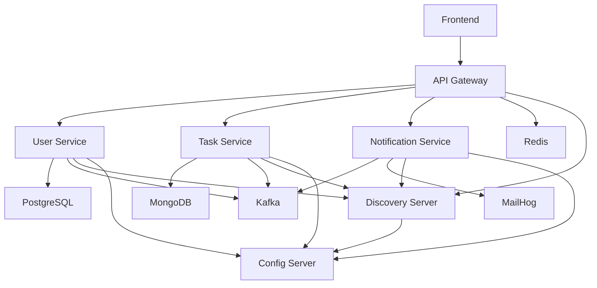

# 🐳 Docker Deployment Guide

Complete guide for deploying Super Pet Platform using Docker Compose.

## 📋 Table of Contents

- [Requirements](#requirements)
- [Quick Start](#quick-start)
- [Architecture](#architecture)
- [Service Management](#service-management)
- [Configuration](#configuration)
- [Debugging](#debugging)
- [Troubleshooting](#troubleshooting)

---

## 🔧 Requirements

### Minimum Requirements:
- **Docker**: 24.0+
- **Docker Compose**: 2.20+
- **RAM**: 8 GB (16 GB recommended)
- **Disk**: 20 GB free space
- **CPU**: 4 cores (recommended)

### Check Versions:
```bash
docker --version
docker-compose --version
```

---

## 🚀 Quick Start

### 1. Build and Start All Services

```bash
# Windows (PowerShell)
.\scripts\build.ps1
.\scripts\start.ps1

# Or manually
docker-compose up -d --build
```

### 2. Check Status

```bash
docker-compose ps
```

### 3. Access Services

| Service | URL | Description |
|---------|-----|-------------|
| 🌐 Frontend | http://localhost:3000 | React application |
| 🔗 API Gateway | http://localhost:8080 | Single entry point |
| 🔐 Keycloak | http://localhost:8180 | IAM (admin/admin) |
| 🔍 Eureka | http://localhost:8761 | Service Discovery |
| 📧 MailHog | http://localhost:8025 | Email testing |
| 📊 Schema Registry | http://localhost:8081 | Avro schemas |

---

## 🏗️ Architecture

### Service Startup Order:

```
1. Infrastructure (parallel):
   ├── PostgreSQL
   ├── MongoDB
   ├── Redis
   └── Kafka (KRaft mode) → Schema Registry

2. Config Server
   └── Centralized configuration

3. Discovery Server (Eureka)
   └── Service Registry

4. Business Services (parallel):
   ├── User Service
   ├── Task Service
   └── Notification Service

5. API Gateway
   └── Request routing

6. Frontend
   └── UI application
```

### Service Dependencies:



---

## 🎮 Service Management

### Management Scripts

#### Build
```bash
.\scripts\build.ps1
```
Compiles Java/Kotlin services and creates Docker images.

#### Start
```bash
.\scripts\start.ps1
```
Starts all services in the correct order.

#### Stop
```bash
.\scripts\stop.ps1
```
Stops all services.

#### Clean
```bash
.\scripts\clean.ps1
```
⚠️ Removes all containers, images, and data!

#### View Logs
```bash
# All services
docker-compose logs -f

# Specific service
.\scripts\logs.ps1 api-gateway

# Last 100 lines
docker-compose logs --tail=100 user-service
```

### Docker Compose Commands

```bash
# Start all services
docker-compose up -d

# Start specific service
docker-compose up -d user-service

# Stop all services
docker-compose down

# Stop and remove volumes
docker-compose down -v

# Rebuild specific service
docker-compose build user-service

# Restart service
docker-compose restart api-gateway

# View status
docker-compose ps

# View resource usage
docker stats
```

---

## ⚙️ Configuration

### Environment Variables

Main environment variables are configured in `docker-compose.yml`.

#### Change Ports:

```yaml
services:
  frontend:
    ports:
      - "3001:80"  # Change to your port
```

#### Database Configuration:

```yaml
postgres:
  environment:
    POSTGRES_PASSWORD: your-secure-password
```

#### Kafka Configuration:

```yaml
kafka:
  environment:
    KAFKA_OFFSETS_TOPIC_REPLICATION_FACTOR: 3  # For production
```

### Environment Profiles

#### Production

```bash
# Create .env file
cat > .env << EOF
SPRING_PROFILES_ACTIVE=production
DATABASE_PASSWORD=secure-password
JWT_SECRET=your-256-bit-secret
KAFKA_SECURITY_PROTOCOL=SASL_SSL
EOF

docker-compose --env-file .env up -d
```

#### Development with Hot Reload

```bash
docker-compose -f docker-compose.yml -f docker-compose.dev.yml up -d
```

Enables:
- Debug ports for Java services (5005-5010)
- Hot reload for frontend
- Detailed logging

---

## 🐛 Debugging

### Debug Ports (in dev mode)

| Service | Debug Port |
|---------|-----------|
| Config Server | 5005 |
| Discovery Server | 5006 |
| User Service | 5007 |
| Task Service | 5008 |
| Notification Service | 5009 |
| API Gateway | 5010 |

### IntelliJ IDEA Connection

1. Run → Edit Configurations
2. Add New → Remote JVM Debug
3. Host: localhost
4. Port: 5007 (for User Service)
5. Debug

### Health Checks

```bash
# Check service health
curl http://localhost:8080/actuator/health
curl http://localhost:8761/actuator/health

# Check all health checks
docker-compose ps
```

### View Logs with Filtering

```bash
# Errors only
docker-compose logs | grep ERROR

# Logs from last hour
docker-compose logs --since 1h

# Logs until specific time
docker-compose logs --until 2024-01-01T12:00:00
```

---

## 🔥 Troubleshooting

### Issue: Services Won't Start

**Solution:**
```bash
# Check logs
docker-compose logs

# Check available resources
docker system df

# Clean unused resources
docker system prune -a --volumes
```

### Issue: "port is already allocated" Error

**Solution:**
```bash
# Find process using port
lsof -i :8080  # Linux/Mac
netstat -ano | findstr :8080  # Windows

# Stop services and change ports in docker-compose.yml
```

### Issue: Out of Memory

**Solution:**
```bash
# Increase memory for Docker Desktop
# Settings → Resources → Memory → 8GB+

# Or limit memory for specific services
services:
  user-service:
    mem_limit: 512m
    mem_reservation: 256m
```

### Issue: Config Server Can't Find Configuration

**Solution:**
```bash
# Check volume mapping
docker-compose exec config-server ls -la /config

# Check logs
docker-compose logs config-server

# Verify files exist
ls -la shared/configs/
```

### Issue: Kafka Connection Failed

**Solution:**
```bash
# Check Kafka status
docker-compose ps kafka

# Restart Kafka
docker-compose restart kafka

# Check topics
docker-compose exec kafka kafka-topics --list --bootstrap-server localhost:9092
```

### Issue: Database Not Initializing

**Solution:**
```bash
# Remove volumes and recreate
docker-compose down -v
docker-compose up -d postgres mongodb

# Check initialization logs
docker-compose logs postgres
docker-compose logs mongodb
```

---

## 📊 Monitoring

### Prometheus Metrics

All services export metrics:
```bash
curl http://localhost:8080/actuator/prometheus
```

### Logging

Logs available via:
```bash
# Real-time logs
docker-compose logs -f

# Export logs to file
docker-compose logs > logs.txt
```

---

## 🔒 Security

### Production Checklist:

- [ ] Change database passwords
- [ ] Use secrets for sensitive data
- [ ] Enable HTTPS for API Gateway
- [ ] Configure Kafka SSL/SASL
- [ ] Limit exposed ports
- [ ] Use non-root users (already configured)
- [ ] Regularly update images

### Using Docker Secrets

```yaml
services:
  postgres:
    secrets:
      - db_password
    environment:
      POSTGRES_PASSWORD_FILE: /run/secrets/db_password

secrets:
  db_password:
    file: ./secrets/db_password.txt
```

---

## 🚀 Performance

### Production Optimization:

```yaml
services:
  user-service:
    deploy:
      resources:
        limits:
          cpus: '2'
          memory: 1G
        reservations:
          cpus: '1'
          memory: 512M
      restart_policy:
        condition: on-failure
        delay: 5s
        max_attempts: 3
```

### Scaling:

```bash
# Run multiple instances
docker-compose up -d --scale user-service=3

# Check load balancing in Eureka
curl http://localhost:8761/eureka/apps
```

---

## 📚 Additional Resources

- [Docker Documentation](https://docs.docker.com/)
- [Docker Compose Documentation](https://docs.docker.com/compose/)
- [Spring Cloud Documentation](https://spring.io/projects/spring-cloud)
- [Kafka Documentation](https://kafka.apache.org/documentation/)

---

## 🤝 Support

If you encounter issues:
1. Check logs: `docker-compose logs [service]`
2. Check health checks: `docker-compose ps`
3. Check resources: `docker stats`
4. Create an issue in the repository

---

**Document Version:** 1.0  
**Last Updated:** 2024
